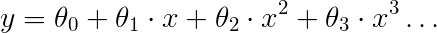
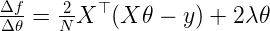

# RoboticaUVic-PR-week1
UVic Robotics Master. Pattern Recognition Homework 1

## Instructions

Fork this repository and write code to complete the assignments. When
executed, your code must print the answers to the questions in each
section, alongside the results that led to these conclusions. Module
*textwrap* can be used to format long paragraphs of text and make them
look nicer. An IPython notebook is an acceptable alternative to a
plain python program.

First upload the completed assignment to the course Moodle for
grading; then, correct all the issues marked by the teacher and push it
to GitHub for the final evaluation.

This is a personal assignment, please complete it **individually**. 

## Preliminaries

This and the next three homework assignments have to be completed
using Python. Python is a very easy to learn and flexible programming
language, with many libraries for the most diverse tasks. There are
currently two main flavours of Python that are not fully compatible:
version 2 (currently 2.7) and version 3 (currently 3.5). In this
course we will be using version 2.7, as the version of OpenCV shipped
with Ubuntu does not support the latter version.

For the homework in this course, we will use the following libraries, mostly from the SciPy family:
- [SciPy](http://www.scipy.org/) is a collection of libraries for scientific computing in Python.
- [Numpy](http://www.numpy.org/) provides the backbone functionality for numerical processing.
- [Matplotlib](http://matplotlib.org/) is a powerful plotting library.
- [Scikit Learn](http://scikit-learn.org/stable/) Is a simple and complete machine learning library for Python.
- [OpenCV](http://opencv.org/) is the reference computer vision and image processing library, with comprehensive Python bindings.

Besides these libraries, [IPython](http://ipython.org/) is recommended as an extended and more friendly interactive Python interpreter. It is also necessary in order to view the course notebooks.

In Ubuntu 14.04, all the required software can be installed with the following commands:

```bash
$ sudo apt-get install python-scipy python-numpy python-matplotlib \
  python-opencv python-sklearn
$ sudo apt-get install ipython
```

Learning Python is extraordinarily easy, especially if other
programming languages are already known. There are some tutorials to
get up to speed in a few minutes:
- *Learn Python in 10 minutes* [tutorial](http://www.stavros.io/tutorials/python/) for beginners
- A very concise and recommendable **Python+Numpy** [tutorial](https://cs231n.github.io/python-numpy-tutorial/) by Justin Johnson
- Official Python 2 [tutorial](https://docs.python.org/2/tutorial/)
- OpenCV-Python [tutorials](https://opencv-python-tutroals.readthedocs.org/en/latest/py_tutorials/py_tutorials.html)

For this assignment, it is recommended to read at least the **Python+Numpy** tutorial.

## Linear Regression 

See the ipython notebook from the class for reference.

- **Q1**) [Download](http://archive.ics.uci.edu/ml/datasets/Housing) the
Housing Data Set from the UCI repository.

- **Q2**) Load the data (using *numpy.loadtxt*) and separate the last column
(target value, MEDV). Compute the average of the target value and the
MSE obtained using it as a constant prediction.

- **Q3**) Split the data in two parts (50%-50%) for training and testing
(first half for training, second half for testing). Train a linear
regressor model for each variable individually (plus a bias term) and
compute the MSE on the training and the testing set. Which variable is
the most informative? which one makes the model generalize better?
and worse? Compute the coefficient of determination (R^2) for the test
set.

 > Hint: If you want to select the i-th column of an array, but want
 > it to retain the two dimension, you can do it like that:  
 > ```python  
 > column = data_array[:,i:i+1] 
 > ```  

- **Q4**) Now train a model with all the variables plus a bias term. What is
the performance in the test set? Try removing the worst-performing
variable you found in step 2, and run again the experiment. What
happened?

- **Q5**) We can give more capacity to a linear regression model by using
*basis functions* (Bishop, sec. 3.1). In short, we can apply
non-linear transformations to the input variables to extend the
feature vector. Here we will try a polynomial function:  
 &nbsp;&nbsp;&nbsp;&nbsp;   
Repeat step 2 but adding, one by one, all
polynomials up to degree 4. What are the effects of adding more
capacity to the model?

## Gradient Descent

As we have seen, overfitting is a problem that arises when we try to
have more powerful methods, able to better adapt to the data. In order
to reduce overfitting, we can **regularize** our model, but then we do
not have a closed form solution and must resort to optimization. First
we will use *Gradient Descent*, which is a widely used optimization
algorithm. Here is a simple implementation in pseudo-code:

```
0. Function Gradient_Descent
1.   Initialize theta(0) at random
2.   t=0, maxit=100, step=0.01, loss=zeros(maxit)
3.   loss(0) = f(theta)
4.   do
5.      t=t+1
6.      theta(t) = theta(t-1) - step * f'(theta(t-1))
7.      loss(t) = f(theta)
8.   While t<maxit
9.   return theta
```

- **Q6**) The objective function *f* for Regularized Linear Regression 
is the following:  
 &nbsp;&nbsp;&nbsp;&nbsp;   
And its derivative *f'* is:  
  &nbsp;&nbsp;&nbsp;&nbsp;   
Implement two functions in Python, one that computes *f* and another
that computes *f'*.  As an optional exercise, work the derivation of
the objective function.

- **Q7**) Implement code to train a regularized linear regression
model using gradient descent according to the previous pseudocode. Use
it to train a model with all variables and then evaluate it in the
test data. 
 > This may be a difficult exercise. Here are some hints to help you finish it successfully:  
 >  - *lambda* is a reserved word for nameless functions in Python; use a different name for the variable. 
 >  - Make sure your *f* and *f'* functions are correct. Here are some
 >  values for reference:  
 >   *f*(data_train_with_bias, labels_train, theta_all_zeros, Lambda=1) = 660.1083  
 >   *f'*(data_train_with_bias, labels_train, theta_all_zeros, Lambda=1) = [ -48.62, -20.40, -676.58, -422.27, -3.90, -24.70, -317.49, -3033.81, -206.06, -222.99, -15327.84, -857.69, -18476.12, -477.47]  
 >   *f*(data_train_with_bias, labels_train, theta_all_0.01, Lambda=1) = 328.66
 >   *f'*(data_train_with_bias, labels_train, theta_all_0.01, Lambda=1) = [ -31.98, -12.23, -485.03, -260.24, -2.55, -15.98, -212.42, -1923.15, -137.89, -146.50, -9899.61, -560.03, -12199.25, -285.86]
 >  - Start with only a few iterations, and check that your loss (computed with *f* ) is decreassing. If it is increasing or doing a zig-zag, lower your learning step.
 >  - To start, use lambda=10 and step=1e-6.

- **Q8**) Writting a good optimization routine is very difficult, with
many particular choices and obscure techniques that require a vast
knowledge of the field. Furthermore, except if you are doing research
on the subject, in general it is not necessary to write your own
function optimization code: there are many libraries that provide
robust implementations. For the rest of the homework we will use
[*fmin_l_bfgs_b*](http://docs.scipy.org/doc/scipy/reference/generated/scipy.optimize.fmin_pl_bfgs_b.html)
as our optimizer. Read the online documentation to figure out how to
use it, and train a model for our data.
  > Hint: You only need to worry about the first four parameters.

## Model Selection

- **Q9**) Different lambda values lead to different models, and we
want to find the one that gives better results in new
data. Unfortunately we cannot use the test data for this, since then
we would have nowhere to test our final model. Instead, we will use
[**cross-validation**](https://en.wikipedia.org/wiki/Cross-validation_%28statistics%29).
In particular, you have to implement [k-fold
cross-validation](https://en.wikipedia.org/wiki/Cross-validation_%28statistics%29#k-fold_cross-validation).
Next, use it to select the lambda parameter for a regularized linear
regression model with *fmin_l_bfgs_b* as the optimizer. As data, use
the polynomial expansion up to degree 5 of the LSTAT variable (last
input variable). Using *matplotlib*, plot the evolution of the
training and validation MSE as you increase the lambda
parameter. Finally, print the MSE of the selected model in the test
set.  
 > - Use the lambda values generated by the following expression:  
 > ```Python  
 >  lambdas = [10**i for i in range(-6,7)]  
 > ```  
 > - *Pylab* offers a very convenient interface to *matplotlib*. Here is
 > a short example code:  
 > ```Python
 >  import pylab
 >  pylab.plot([1,2,3,4], [4,6,3,7], '-b')
 >  pylab.plot([1,2,3,4], [1,2,7,9], '-.r')
 >  pylab.title('Demo plot')
 >  pylab.legend(['first function', 'second function'])
 >  pylab.show()
 > ```
 > - You will want to use a logarithmic scale for the lambdas. To use it, 
 > just type:  
 > ```Python
 >  pylab.xscale('log') # or alternatively pylab.yscale('log')
 > ```

- **Q10**) We are almost done! In this last task we will visualize the
effect of regularization in a *cost surface*. Using bias and a single
variable our model has two parameters, which means we can plot each
possible model in an area, and assign it a color based on the loss for
the particular choice of parameters. Complete the following code, and
use it to visualize the cost surface of the second variable (ZN) for
several choices of lambda, ranging from very small to very large. As
an optional exercise try alternating between the L2 norm to the L1 norm
in the objective function. Describe what you observe.  
 ```python
 def plot_cost_surface(f, features, labels, Lambda):
    from matplotlib import pyplot
    XX, YY = np.meshgrid(np.arange(-10,10,0.1), np.arange(-10,10,0.1))
    ZZ = np.zeros(XX.shape)
    for i in range(XX.shape[0]):
        for j in range(XX.shape[1]):
	    #<COMPLETE THIS CODE>
    pyplot.imshow(ZZ)
    N=ZZ.shape[0]
    pyplot.title('Lambda = %.4f'%Lambda)
    pyplot.xticks([0,N/4,N/2,3*N/4,N-1],['-10','-5','0','5','10'])
    pyplot.yticks([0,N/4,N/2,3*N/4,N-1],['10','5','0','-5','-10'])
    pyplot.colorbar()
    pyplot.show()
 ```

## Extra

In case you have not had enough, here are a couple of things you can try next:

- The [UCI
repository](http://archive.ics.uci.edu/ml/datasets.html?format=&task=reg&att=&area=&numAtt=&numIns=&type=&sort=nameUp&view=table)
has many datasets for regression collected over the years. Select
one or a few, and try to solve them using the tools you have
developed during this homework.

- Think of how you would use linear regression to improve or automate
some aspect of your work or daily life (doesn't need to make a lot
of sense), and describe the way in which you would approach the
problem.
